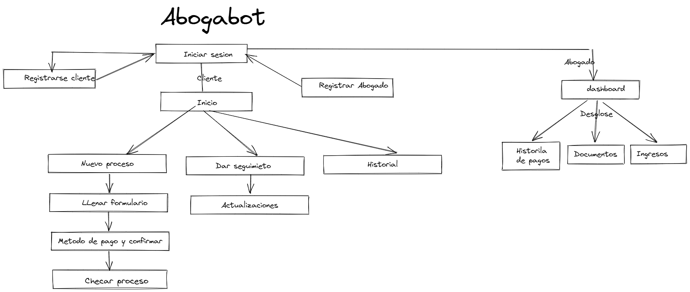

# Abogabot

### Toma de requerimientos
* El cliente pide un formulario a llenar sobre algun proceso
* Pide al antes de finalizar el proceso un metodo de pago bancario para ser enviado.
* Pide que el cliente y un admistrador pueda crear un cuenta en al app para que pueda dar seguimiento su proceso.
* El administrador le llegara notificacion de los pagor e igual de nuevas demandas y los procesos le llegara documento WORD.
* Administrador pueda agregar comentario actualizacion que le envie al usuario.
* El administrador tendra un dashboard donde puede ver cantidad ingreso en tiempo real de cada pago.
* Los usuarios les llegaran correos de actualizaciones nuevas o igual podra ver notificacion es su perfil creada en la app.
* App debe ser responsive a dispositivos moviles.
* colores  azul marino y blanco.

### Diagrama

### Buyer persona

### Publico Objetivo

### IU
- [WIREFRMA EN FIGMA](https://www.figma.com/file/PLRiD8FaJKuu3BnVi3EF9H/wireframe-UX?node-id=0%3A1)
## UI
- [IU EN FIGMA](https://www.figma.com/file/3ebhUWnkeVzwkC5dRz5D2h/UX)
